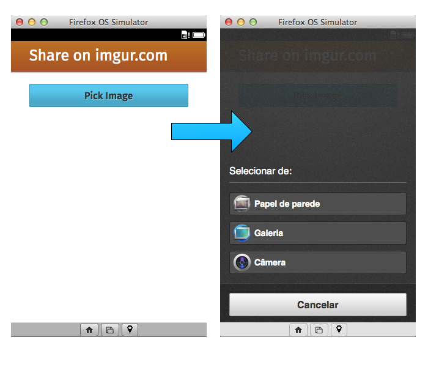

# Grundkonzepte {#concepts}

Bevor wir uns an unserer ersten App die Hände schmutzig machen, lass uns einige Grundkonzepte über die Entwicklung für Firefox OS lernen. Wir haben in der [Einführung](#introduction) gelernt, dass Firefox OS Apps genauso wir Websites auf HTML5 basieren. Allerdings haben wir nicht erklärt, worin sich Firefox OS Apps von gewöhnlichen Seiten unterscheidet.

Falls wir unser Wissen über andere Mobilplattformen zusammentragen, können wir sehen, dass native Anwendungen im Normalfall folgendes auszeichnet:

* Einen Namen und ein Icon zum Starten der Anwendung.
* Zugriff zu Systemdiensten und Hardware-Funktionen.

Wenn wir auf das große Ganze blicken, ist eine Firefox OS-App nur eine Webseite mit einem Icon, einem Namen und ist üblicherweise dazu in der Lage, offline zu arbeiten (je nachdem, wie die App geschrieben wurde). All diese Daten wie Name, Icon und mehr ist in einer *Anwendungs-Manifest-Datei* definiert, die den Schwerpunkt des nächsten Abschnitts einnehmen wird.

## Das Anwendungs-Manifest

Das [Manifest](https://developer.mozilla.org/docs/Apps/Manifest) ist eine [JSON](http://json.org)-Datei, die Aspekte einer Hosted App beschreibt. Gewöhnlich wird diese Datei **manifest.webapp** genannt und befindet sich neben deiner Haupt-HTML-Datei mit dem üblichen Namen **index.html**.

<<[Beispiel-Manifest](code/sample_manifest.webapp)

Oben sehen wir ein Manifest für eine Anwendung namens Memos[^memos]. Neben anderen Dingen beschreibt es, wer die Anwendung erstellt hat, welche Icons benutzt werden, wie der Name der App lautet, welche Datei zum Starten der App benutzt wird (hier *index.html*), welche Hardware-Berechtigungen die App verlangt usw. Diese Datei wird von Firefox OS dazu benutzt, die Anwendung zum Startbildschirm  des Geräts hinzuzufügen und von Firefox Marketplace, um die Anwendung im Katalog darzustellen, wie wir im unteren Bild sehen können.

[^memos]: Dies ist eine Beispiel-App für Firefox OS, wie man [auf dem Firefox Marketplace sehen kann](https://marketplace.firefox.com/app/memos). Der [Quellcode liegt auf GitHub](https://github.com/soapdog/memos-for-firefoxos).

Sieh, wie die Informationen aus dem Manifest vom System benutzt werden, um die Anwendung dem Startbildschirm hinzuzufügen, wie das Bildschirmfoto unten zeigt.

Indem du deine HTML-, CSS-, JavaScript und eine Manifest-Datei zusammenträgst, hast du bereits eine Anwendung, die auf Firefox OS laufen kann. Lass uns jetzt mehr über die vorhandenen Anwendungstypen lernen, während wir mit den Grundkonzepten in diesem Thema fortschreiten.

## Anwendungstypen

Firefox OS hat derzeit zwei Typen von Anwendungen: Hosted Apps und Packaged Apps - auch wenn weitere Typen in Zukunft hinzukommen mögen (wie angepasste Tastaturen und die Fähigkeit, andere Systemdienste zu erstellen).

* **Hosted Apps:** Werden auf einem Webserver wie normale Websites gehosted. Das bedeutet, wenn der Nutzer eine Hosted App startet, wird ihr Inhalt von einem entfernten Server (oder aus dem Cache, sofern verfügbar) geladen.
* **Packaged Apps:** Werden als Zip-Datei verteilt und auf das Gerät bei der Installation kopiert. Sobald ein Nutzer eine Packaged App startet, wird ihr Inhalt aus der Zip-Datei geladen statt von einem entfernten Server.

Beide Typen haben ihre Vor- und Nachteile. Auf der einen Seite sind Hosted Apps leichter zu warten, denn du musst nur Dateien auf deinem Webserver warten. Andererseits wird es schwieriger, sie offline arbeitsfähig zu machen, denn das benötigt den Einsatz des verachteten [AppCaches](https://developer.mozilla.org/en-US/docs/HTML/Using_the_application_cache). Hosted Apps sind also beschränkt, was die WebAPIs angeht und können deswegen nicht alles, was eine Packaged App tun kann.

Andererseits haben Packaged Apps all ihren Inhalt im Speicher des Geräts - was bedeutet, dass sie immer erreichbar sind, auch wenn der Benutzer offline ist (und damit AppCache nicht benötigen). Sie können außerdem Zugriff auf sicherheitsrelevante WebAPIs bekommen, die Hosted Apps verwehrt bleiben. Eine Packaged App zu aktualisieren kann andererseits schmerzvoll werden, denn du musst eine neue Version im Firefox Marketplace einreichen - und damit noch einmal durch den Review-Prozess, was einige Zeit in Anspruch nehmen kann.

Wenn du dich für einen Typ von Anwendungen entscheiden willst, beachte: Wenn du erweiterte WebAPIs benötigst, solltest du eine Packaged App benutzen. Wenn deine Anwendung allerdings auch ohne Zugriff auf erweiterte Systemdienste oder Gerätfähigkeiten neben den in einem Webbrowser üblichen auskommt, wähle immer eine Hosted App. Es ist in Ordnung, wenn du eine Packaged App benutzt, weil du keinen Platz zum Hosten hast.

Oben erwähnte ich AppCache, welches problematisch werden kann (und trotzdem für Hosted Apps benötigt wird). Mach dir nicht zu viel Gedanken, denn es gibt Werkzeuge, die das Erstellen und Verteilen von AppCache erleichtern [^js-tools].

In diesem Buch werden wir zusammen eine Packaged App erstellen und dabei erkunden, was man mit WebAPIs alles anstellen kann. Das meiste, was wir über Manifest-Dateien lernen werden, trifft ebenfalls auf Hosted Apps zu. Wenn du mehr zum Vertreiben von Hosted Apps lernen willst, lies [den Hosted App-Link im Entwickler-Netzwerk](https://marketplace.firefox.com/developers/docs/hosted).

[^js-tools]: Es gibt jede Menge nützlicher Werkzeuge, sieh dir [Grunt](gruntjs.com), [Volo](http://volojs.org/), [Yeoman](http://yeoman.io/) und [Bower](http://bower.io/) an. Es gibt eine Menge Gemeinsamkeiten zwischen diesen Werkzeugen, so dass es eher eine Sache der persönlichen Vorliebe ist, welche du benutzt. (Ich mag Volo mehr als Grunt, in erster Linie, weil Volo-Dateien leichter für mich zu lesen sind).

Nachdem wir jetzt die beiden von Firefox OS unterstützten Anwendungstypen kennengelernt haben, lass uns einen Blick auf die verschiedenen Stufen des Systemzugriffs werfen.

## Sicherheitszugriffs-Levels

Es gibt drei Sicherheitslevel für Firefox OS - wobei jeder Level mehr Zugriff auf APIs gewährt bekommt als der vorige.

* **Einfach (auch bekannt als: Web):** Dies ist der Standard-Level für alle Anwendungen. Es trifft auf Hosted Apps und Packaged Apps zu, die nicht eine `type`-Eigenschaft in ihrer Manifest-Datei haben. Diese Apps haben Zugriff auf die übliche Menge an APIs von Browsern - aber sie haben keinen Zugriff auf Mozillas WebAPIs.
* **Privilegiert:** Dieser Typ Apps hat Zugriff auf alle üblichen APIs vom Firefox Browser, sowie einigen weiteren wie Kontakte und Systemalarm. Nur **Packaged Apps können priveligierte Apps** werden und das Paket muss digital im Firefox Marketplace signiert worden sein.
* **Zertifiziert:** Aus Sicherheitsgründen ist dieses Level nur für Mozilla und seine Partner (z.B. Smartphone-Hersteller, Telekommunikations-Unternehmen usw.) verfügbar. Zertifizierte Apps haben Zugriff auf alle APIs wie Telefonie und mehr. Ein Beispiel einer zertifizierten App ist das Firefox OS Rufnummern-Wählprogramm.

Während der Entwicklung ist es für uns möglich, auf privilegierte APIs ohne besondere Zustimmung von Mozilla zuzugreifen. Aber sobald wir eine privilegierte App vertreiben wollen, müssen wir sie zunächst im Firefox Marketplace einreichen. Dort wird der Code als Teil eines strengen Zulassungssprozesses überprüft und wenn es für gut befunden wird, wird es digital signiert - was dem Benutzer mitteilt, dass diese App berechtigt ist, auf sensible APIs zuzugreifen.

Auf [der Seite über WebAPIs in Mozillas Entwickler-Netzwerk](https://developer.mozilla.org/de/docs/Web/WebAPI) können wir sehen, welche APIs auf welcher Plattform implementiert wurden und welcher Zugriffslevel für welche API benötigt wird.

Wie wir im obigen Bild sehen können, kann jede Anwendung auf die *IndexedDB und FileHandle API* zugreifen, aber nur privilegierte App kann auf die *Contacts API und Device Storage API* zugreifen.

## Mozillas WebAPIs

Firefox OS stellt uns APIs zur Verfügung, die es erlauben, Anwendungen zu entwickeln, die genauso mächtig sind, wie native Apps auf anderen Plattformen. Zugriff auf die Hardware und Dienste ist über die WebAPIs möglich. Um mehr über die Liste der verfübaren APIs zur aktuellen Firefox OS Version zu erfahren, schau dir [die WebAPI-Seite im Mozilla Wiki](https://wiki.mozilla.org/WebAPI) an.

Lass uns einige Code-Beispiele näher betrachten, um zu sehen, wie einfach diese APIs zu benutzen sind. Betrachte dieses Beispiel nicht als eine vollständige Dokumentation jener WebAPIs, den sie sind nur einige Vorschläge, um dir zu zeigen, wie Geräte-Funktionen mit JavaScript angesprochen werden können.

### Beispiel #1: Aufrufe tätigen

Stell dir vor, deine Anwendung muss die Rufnummer mit einer vorgewählten öffnen. Du kannst einfach den folgenden Code benutzen:

<<[Eine Nummer an das Rufnummern-Wählprogramm senden](code/webapi_samples/dial.js)

Dieser Code stellt eine Anforderung an die Rufnummer-App, um eine bestimmte Nummer anzurufen. Beachte, dass dies nicht zur tatsächlichen Wahl der Nummer führen - der Benutzer muss immer noch auf Abheben drücken, um die Nummer zu wählen. Eine explizite Nutzer-Aktion zu fordern, bevor irgendwelcher Code ausgeführt wird, ist ziemlich üblich: es ist ein gutes Sicherheitsmuster, denn es verlangt eine Interaktion über das Einverständnis, bevor irgendetwas passieren kann. Andere APIs zur Rufnummernwahl ohne Interaktion sind für höhere Zugriffslevel verfügbar. Zertifizierte Apps können beispielsweise Rufnummern ohne irgendeine Interaktion wählen. Die im obigen Code benutzte API wird "Web Activities" genannt und ist für alle Apps verfügbar.

Lies im Mozilla Blog für [weitere Informationen zu Web Activites](https://hacks.mozilla.org/2013/01/introducing-web-activities/).

### Beispiel #2: Einen Kontakt speichern

Stell dir vor, du hast ein Unternehmens-Intranet und möchtest eine Möglichkeit anbieten, einen Kontakt vom Intranet-Adressbuch in das Adressbuch auf dem Smartphone zu übertragen. Das kannst du mit der Contacts API erledigen.

<<[Einen Kontakt speichern](code/webapi_samples/contact.js)

Diese API erstellt ein Objekt mit dem Kontakt-Daten und speichert es im Adressbuch des Smartphones ohne eine Benutzerinteraktion zu erfordern. Weil der Zugriff auf Kontakte potentielle Datenschutzverletzungen beinhaltet, ist diese API nur für *privilegierte Apps* zugänglich. Dieses Muster, bei dem du ein Objekt erstellst und einen success- und einen error-Callback einrichtest, wird in vielen WebAPIs eingesetzt.

Um mehr über diese API zu erfahren, lies [die Seite über *Contacts API* im Mozilla Wiki](https://wiki.mozilla.org/WebAPI/ContactsAPI).

### Beispiel #3: Ein Bild von der Kamera wählen

Stell dir vor, du entwickelst eine Anwendung, die extravagante Filter auf Bilder anwendet. Du möchtest einen Knopf in deiner App platzieren, die es dem Benutzer erlaubt, ein Bild aus dem Foto-Album oder von der Kamera auszuwählen.

<<[Ein Bild auswählen](code/webapi_samples/pick.js)

Hier haben wir ein anderes Beispiel einer [WebActivity](https://hacks.mozilla.org/2013/01/introducing-web-activities/). Diese Aktivitäten sind für alle Anwendungen verfügbar. In diesem speziellen Fall benutzen wir die *pick* activity und übergeben ihr *MIME-Typen* von Dateien, die wir erhalten wollen. Wenn dieser Code ausgeführt wird, zeigt das System dem Nutzer einen Bildschirm, um ihn oder sie zu fragen, ein Bild von der (Kamera, Gallerie, Hintergrundbilder) auszuwählen. Wenn der Benutzer ein Bild auswählt, wird der success-Callback getriggert. Wenn der Benutzer den Vorgang abbricht, wird der error-Callback ausgeführt. In unterem Bild können wir den Dialog sehen, der den Nutzer ein Bild auswählen lässt:

## Zusammenfassung

In diesem Kapitel sahen wir, dass anders als normale Websites bei Firefox OS sowohl Hosted Apps und Packaged Apps auf Manifest-Dateien beruhen. Wir sahen ebenfalls, dass von einem Sicherheitsstandpunkt Packaged Apps entweder "privilegiert" oder "zertifiziert" sein können. Nur privilegierte und zertifizierte Apps bekommen Zugriff auf Mozillas mächtige WebAPIs. Die WebAPIs sind nicht für Hosted Apps oder normale Websites verfügbar.

Jetzt wird's aber Zeit, unsere Hände an einer ersten App schmutzig zu machen!
