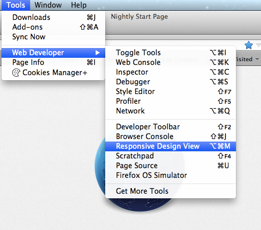
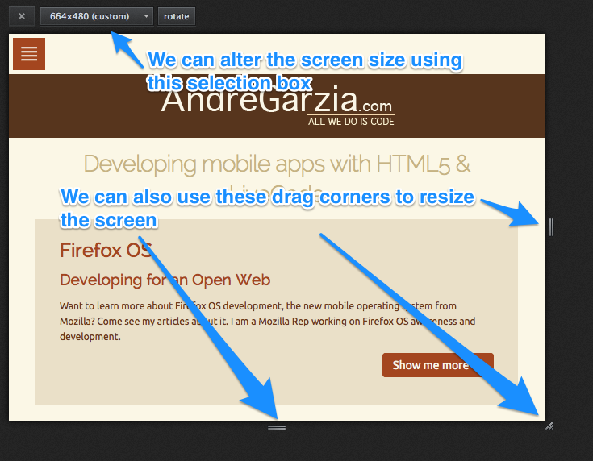
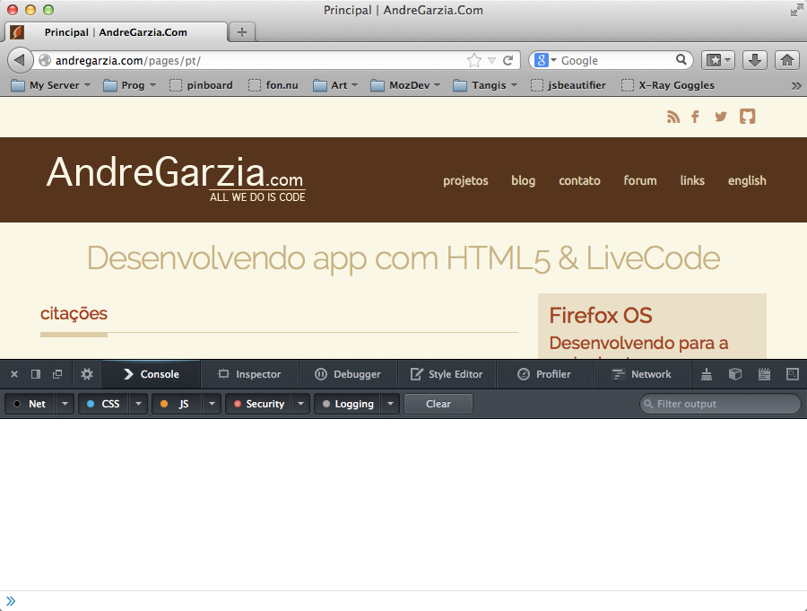

# Entwickler-Werkzeuge {#developertools}

Firefox bringt eine Menge Werkzeuge mit, die Web-Entwickler in ihrer Arbeit unterstützen. Viele Menschen nutzen immer noch [FireBug](https://addons.mozilla.org/de/firefox/addon/firebug/) und haben immer noch nicht realisiert, dass Firefox mit eingebauten Werkzeugen daherkommt. In diesem Kapitel werden wir diejenigen begutachten, die am nützlichsten zum Entwickeln von Firefox OS-Apps sind.

Wenn du mehr über diese und andere Werkzeuge lernen möchtest, die in Firefox ankommen sollen, lies die [Entwickler-Werkzeuge](https://developer.mozilla.org/de/docs/Tools)-Seite im Mozilla Entwickler-Netzwerk (du solltest es wirklich lesen! Ich werde warten).
 
## Bildschirmgröße testen

Ein üblicher Workflow in der Web-Entwicklung ist das Ändern einer HTML-Datei und dann das Neuladen dieser im Browser, um zu sehen, was sich geändert hat. Wenn du nicht gerade Grunt oder Volo benutzt, wird es keinen Bedarf für einen Kompilierungs-Schritt oder dergleichen geben. Selbst der Firefox OS Simulator erlaubt dir den selben Workflow, auch wenn der Emulator derzeit auf eine Auflösung (480x320) beschränkt ist. Dies ist weniger ideal, wenn du deine App auch zum Arbeiten auf Tablets, Phablets und riesige TV-Bildschirme oder irgendwas dazwischen entwirfst.

Um zu überprüfen, wie deine App auf einer beliebigen Auflösung aussiehst, kannst du die **Bildschirmgröße testen**-Funktion von Firefox benutzen, um den Bildschirm (und Viewport) zu ändern. Es kann im **Werkzeug-Menü -> Web-Entwickler -> Bildschirmgröße testen** eingeschaltet werden, wie man im Bild unten sehen kann. Sowie du dieses Werkzeug aktivierst, wird sich das Fenster verändern, so dass du die Viewport-Größe aus der Auswahlliste wählen oder mit den Anfassern anpassen kannst.

Die Bildschirmgröße zu testen wird gerade dann nützlich, wenn [**media queries**](https://developer.mozilla.org/en-US/docs/Web/Guide/CSS/Media_queries) überprüft werden sollen, da sie ein Ändern der Bildschirmgröße erlaubt und das Ändern des Layouts in Echtzeit betrachtet werden kann. Eine weitere tolle Funktion beim Testen der Bildschirmgröße liegt darin, vordefinierte Größen zu speichern. Wenn du die Größe des Viewports vom Zielgerät kennst, kannst du verschiedene Viewport-Größen schnell überprüfen, ohne das Browserfenster an sich ändern zu müssen.

Zum Zeipunkt des Schreibens liefen die meisten Firefox OS-Geräte auf dem Markt mit einer Auflösung von 480x320 - bei einer Pixelrate von ungefähr 96ppi. Du solltest jedenfalls erwarten, dass neuere Firefox OS-Hardware sich mit der Zeit ändern werden: Bildschirme werden voraussichtlich mehr Pixel reinpacken und eine höhere Pixeldichte aufweisen (wie Apples Retina-Displays).

Um deine App für die Zukunft zu rüsten, stütze dich im CSS nicht auf irgendeine Auflösung oder Pixel-Dichte. Nutze stattdessen Media Queries und die Responsive Design-Methode, um Apps zu entwickeln, die sich an eine beliebige Bildschirmgröße anpassen. Wenn du mehr darüber lernen möchtest, empfehle ich dir die Bücher [Responsive Web Design](http://www.abookapart.com/products/responsive-web-design) und [Mobile First](http://www.abookapart.com/products/mobile-first).

Zusammengefasst erlaubt uns das Testen der Bildschirmgröße unsere Webanwendung für viele verschiedene Bildschirmgrößen zu testen, ohne das Firefox-Fenster selbst ändern zu müssen. Meiner bescheidenen Meinung nach ist dies eine der nützlichsten Web-Developer-Werkzeuge da draußen - aber es hat eine große Einschränkung: Derzeit erlaubt es dir nicht, verschiedene Pixel-Dichten zu testen (um beispielsweise herauszufinden, wie gut deine Seite auf einem Retina-Display aussähe).

## Entwickler-Werkzeuge

Die Entwickler-Werkzeuge von Firefox sind vergleichbar mit FireBug und denen von anderen modernen Browsern. Mit diesen kannst du dein JavaScript mit [der Konsole](https://developer.mozilla.org/en-US/docs/Web/API/console) ausführen und debuggen, sowie sowohl den DOM als auch das CSS auf der aktuellen Seite manipulieren.

Um die Konsole zu starten, hast du zwei Möglichkeiten:

  * Über "Werkzeuge > Web Developer > Web Console"
  * auf der zu debuggenden Seite rechtsklicken und "Dieses Element untersuchen" auswählen, danach auf den Reiter "Konsole" klicken.

 

Neben der *JavaScript-Konsole* gibt es noch viele weitere Werkzeuge wie [*die Stilbearbeitung*](https://developer.mozilla.org/en-US/docs/Tools/Style_Editor), [*die Netzwerkkanalanalyse*](https://developer.mozilla.org/en-US/docs/Tools/Network_Monitor), [*die Laufzeitanalyse*](https://developer.mozilla.org/en-US/docs/Tools/Profiler), [*den JavaScript-Debugger*](https://developer.mozilla.org/en-US/docs/Tools/Debugger), [*den Seiten-Inspektor*](https://developer.mozilla.org/de/docs/Tools/Seiten_Inspektor) und viele weitere.

In der Anwendung aus dem vorigen Kapitel haben wir die Konsole benutzt, um den Fortschritt des Programms zu überprüfen. Dies ist eine ziemlich mächtige Methode, um unsere Apps zu debuggen - aber einige Entwickler benutzen immer noch `alert()` für all ihren JavaScript-Code als "Debug-Werkzeug".

Das Benutzen von `alert()` ist eine ziemlich schlechte Idee, denn wenn du auch nur eines von ihnen vergisst, wird der Benutzer schlussendlich den Preis dafür bezahlen müssen. Mit der Konsole umgehst du dieses Problem, denn es lenkt alle Ausgeben schadlos (und stumm!) an einen Ort, den ein Benutzer normalerweise nicht sieht - und verdirbt damit nicht das Benutzererlebnis. Es hat darüber hinaus den Vorteil, dass du nicht unbedingt deine Konsolen-Nachrichten entfernen musst, es sei denn, du willst es. Das kann das Warten und Debuggen von Code bei Bedarf (und der tritt im Allgemeinen bei jeder Software auf!) deutlich erleichtern.

Das korrekte Benutzen der Entwickler-Werkzeuge im Firefox (oder welchen Browser du auch immer benutzt) ist ein wichtiger Schritt, um ein besserer Programmierer zu werden. Darum empfehle ich jeden, den obigen Links zu folgen, um mehr mit den verfügbaren Werkzeugen im Firefox vertraut zu werden.

Ein besonderes Werkzeug, auf dass ich oben nicht eingegangen bin, ist der [*Remote-Debugger*](https://developer.mozilla.org/de/docs/Tools/Remote_Debugging). Dieser erlaubt es, ein Android- oder FirefoxOS-Gerät mit dem Rechner zu verbinden und die Entwickler-Werkzeuge zu benutzen, um Code in Echtzeit auf dem Gerät zu debuggen.

## Zusammenfassung 

Dieses Kapitel bot eine kurze Einführung in die Entwickler-Werkzeuge, die mit Firefox ausgeliefert werden. Das Benutzen dieser wird den Entwicklungsprozess vereinfachen, insbesondere, wenn du sie zusammen mit dem Firefox OS Simulator benutzt. Sie sind unersetzlich beim Zusammensetzen einer Anwendung. Im nächsten Kapitel werden wir mehr über den Simulator lernen und damit, wie wir das beste aus ihm 'rausholen.
