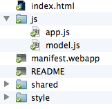
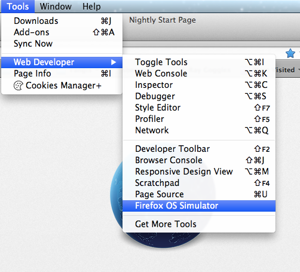
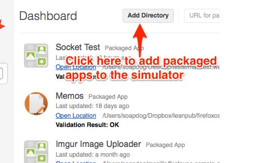

# Unsere erste App {#firstapp}

In diesem Kapitel werden wir eine einfache **Memos**-Anwendung entwickeln, also eine Anwendung zum Aufnehmen von Notizen. Bevor wir mit dem Code schreiben anfangen, lass uns die Arbeitsweise durchgehen.

Die App besitzt drei Ansichten. Die erste ist die Hauptdarstellung und beinhaltet eine Liste aller gespeicherten Notizen anhand ihres Titels. Wenn du auf eine Notiz anklickst (oder eine neue erstellst), wirst du zu einer Detailansicht geleitet, die dir eine Bearbeitung des Inhalts und Titels erlaubt. Dies wird in der Abbildung unten dargestellt.

In der obigen Ansicht kann der Benutzer eine bestimmte Notiz löschen, indem er auf den Papierkorb klickt. Dies ruft eine Bestätigungsabfrage hervor.

Der Quellcode von Memos ist im [Memos GitHub-Repo](https://github.com/soapdog/memos-for-firefoxos) verfügbar (ebenfalls als [.zip](https://github.com/soapdog/memos-for-firefoxos/archive/master.zip)-Archiv). Ich empfehle dir, die Dateien herunterzuladen, so dass du den Vorgang leichter mitverfolgen kannst. Eine weitere Kopie des Quellcodes findet sich im **code**-Ordner innerhalb des [GitHub-Repositorys für dieses Buch](https://github.com/soapdog/firefoxos-quick-guide).

Memos benutzt [IndexedDB](https://developer.mozilla.org/de/docs/IndexedDB/IndexedDB_verwenden), um die Notizen zu speichern und die [Gaia Building Blocks](http://buildingfirefoxos.com/building-blocks), um die Oberfläche aufzubauen. In einer späteren Ausgabe dieses Buches werde ich mehr über die Building Blocks sprechen, aber für den Augenblick benutze ich sie einfach. Du kannst die obigen Links benutzen, um mehr über sie zu erfahren und welche Oberflächen-Werkzeuge sie bereitstellen.

Der erste Schritt besteht darin, einen Ordner für die Anwendung zu erstellen; nennen wir ihn **memos**:

## Erstellen des App-Manifests

Das Manifest von Memos ist ziemlich selbsterklärend. Erstelle eine Datei namens **manifest.webapp** im **memos**-Ordner. Die Manifeste sind [JSON](http://json.org)-Dateien, welche eine Anwendung beschreiben. In dieser Datei werden Dinge festgehalten wie der Name der App, wer der Entwickler ist, welche Icons benutzt werden sollen, welche Datei beim Start aufgerufen werden soll, welche privilegierten APIs du gerne benutzen möchtest und mehr.

Unten sehen wir den Inhalt der Memos Manifest-Datei. Pass auf, wenn du diese Datei kopierst, denn es ist sehr leicht, ein Komma an der falschen Stelle zu platzieren und damit ein invalides JSON zu erhalten. Es gibt viele Werkzeuge, mit denen du JSON-Dateien validieren kannst, aber ein spezielles zum Prüfen von App-Manifesten. Du findest dieses Werkzeug unter [http://appmanifest.org/](http://appmanifest.org/). Um mehr über App-Manifeste zu lernen, lies [diese Seite auf MDN über sie](https://developer.mozilla.org/docs/Apps/Manifest).

<<[Manifest-Datei von Memos(*manifest.webapp*)](code/memos/manifest.webapp)

Lass uns einmal die einzelnen Felder davon durchgehen.

|Feld		|Beschreibung|
|---------------|-----------------------------------------------------------------------|
|name		|Dies ist der Name der Anwendung.                                       |
|version	|Dies ist die aktuelle Version der App.				        |
|launch_path    |Die beim Start zu benutzende Datei.		                        |
|permissions    |Welche API-Berechtigungen deine App anfordert. Mehr dazu weiter unten. |
|developer      |Der Entwickler dieser Anwendung. 				        |
|icons		|Die von der App benutzten Icons in verschiedenen Größen.               |

Der interessanteste Teil dieses Manifests ist das Berechtigungsfeld, wo wir um die *storage*-Berechtigung bitten, die uns die Benutzung von IndexedDB ohne Einschränkungen[^storage-permission] erlaubt (dank dieser Berechtigung können wir dann also so viele Notizen speichern, wie wir wollen - auch wenn wir darauf bedacht sein sollten, nicht zu viel Speicher zu belegen!).

[^storage-permission]: Um mehr über Berechtigungen zu erfahren lies [die Seite auf MDN über App-Berechtigunge](https://developer.mozilla.org/en-US/docs/Web/Apps/App_permissions).

Jetzt wo das Manifest steht, lass uns zum HTML übergehen.

## Das HTML erstellen

Bevor wir uns dem HTML zuwenden, lass uns einen schnellen Ausflug zu den [Gaia Building Blocks](http://buildingfirefoxos.com/building-blocks) machen, welche eine Sammlung von wiederverwendbaren CSS und JavaScript darstellen, um das *Look and Feel* von Firefox OS in unseren eigenen Apps wiederzugeben.

Wie auch in anderen Bereichen des Internets zwingt dich auch hier niemand, dass *Look and Feel* von Firefox OS in deine eigene Apps zu übernehmen. Die Verwendung der Gaia Building Blocks ist eine Frage des persönlichen Geschmacks - und eine gute Anwendung sollte ihren ihr eigenen Stil und Benutzererfahrung haben. Der Punkt besteht darin, zu verstehen, dass deine App keine Strafe oder Abwertung im Firefox Marketplace erhalten wird, wenn du nicht den Look and Feel von Gaia übernimmst. Ich verwende es hier, weil ich nicht so ein guter Designer bin und daher fertig benutzbarer Oberflächen auf mich ansprechend wirken (entweder das oder ich muss mir einen Designer einstellen).

Die HTML-Struktur in unserer Anwendung wurde nach einigen Mustern in den Gaia Building Blocks ausgerichtet, bei der jeder Bildschirm in einem eigenen `<section>` eingeschlossen wird und die Elemente einem vordefinierten Format folgen. So du es noch nicht getan hast, lade dir den Quellcode vom [Memos Repository](https://github.com/soapdog/memos-for-firefoxos) herunter, so dass du die Dateien (einschließlich der Building Blocks) zur Verfügung hast. Sofern du nicht mit git und GitHub vertraut bist, findest du die Dateien auch als [.zip-Archiv](https://github.com/soapdog/memos-for-firefoxos/archive/master.zip). 

W> Warnung: Die von mir benutzte Version der Gaia Building Blocks ist nicht die aktuellste, die Mozilla bereitstellt. Wenn ich versuche, auf die neueste zu aktualisieren, zerbricht daran leider meine Memos App. Versuche aber in deinen eigenen Projekten, die jeweils neueste Version der Gaia Building Blocks zu benutzen.

### Die Building Blocks einbinden

Bevor du irgendetwas machst, kopiere dir die Ordner **shared** und **styles** aus dem Memos-Repository in den **memos**-Ordner, den du angelegt hast. Dies erlaubt es uns, die Gaia Building Blocks in unserer App zu benutzen.

Lass uns mit der **index.html** anfangen, indem wir die benötigten Schnippsel einfügen.

~~~~~~~~
<!DOCTYPE html>
<html>
<head>
    <meta charset="utf-8">
    <link rel="stylesheet" type="text/css" href="style/base.css" />
    <link rel="stylesheet" type="text/css" href="style/ui.css" />
    <link rel="stylesheet" type="text/css" href="style/building_blocks.css" />
    <link rel="stylesheet" type="text/css"
          href="shared/style/headers.css" />
    <link rel="stylesheet" type="text/css"
          href="shared/style_unstable/lists.css" />
    <link rel="stylesheet" type="text/css"
          href="shared/style_unstable/toolbars.css" />
    <link rel="stylesheet" type="text/css"
          href="shared/style/input_areas.css" />
    <link rel="stylesheet" type="text/css"
          href="shared/style/confirm.css" />
    <title>Memos</title>
</head>
~~~~~~~~

In *Zeile 01* deklarieren wir den DOCTYPE als HTML5. Von *Zeile 05 bis 17* binden wir das CSS für die verschieden Komponenten ein, die wir in unserer App benutzen werden, etwa Kopfzeilen, Listen, Textfelder und mehr.

### Die Hauptansicht erstellen

Jetzt können wir anfangen, die verschiedenen Ansichten zu erstellen. Wie ich bereits früher erwähnte, liegt jede Ansicht unserer App innerhalb einer `<section>`, die sich im `<body>`-Tag befindet. Dieses wiederum muss das Attribut *role* mit dem Wert *application* besitzen, damit die CSS-Selektoren darauf zugreifen können, um das Interface zu konstruieren. Von daher wird unser Body-Tag die Gestalt `<body role="application">` haben. Lass uns also die erste Ansicht erstellen und dabei auch den Body-Tag deklarieren.

~~~~~~~~
<body role="application">

<section role="region" id="memo-list">
    <header>
        <menu type="toolbar">
            <a id="new-memo" href="#">add</a>
        </menu>
        <h1>Memos</h1>
    </header>
    <article id="memoList" data-type="list"></article>
</section>
~~~~~~~~

Unsere Ansicht hat einen `<header>`, der einen Knopf zum Hinzufügen neuer Notizen beinhaltet, und einen Anwendungsnamen. Daneben besitzt sie auch einen `<article>`, der die Liste aller gespeicherten Notizen beinhalten wird. Wir werden den Knopf und die article-IDs benutzen, um Events zu fangen, wenn wir später den Abschnitt zur JavaScript-Implementierung erreichen.

Sieh nur, wie jede Ansicht ein regelrecht selbsterklärender Teil HTML darstellt. Genau solche Bildschirme in verschiedenen Programmiersprachen umzusetzen, bedarf normalerweise eine Menge Arbeit. Hier deklarieren wir nur unsere Container und geben ihnen IDs, um später auf sie zu referenzieren.

Jetzt wo die Hauptansicht fertig ist, kümmern wir uns um die Darstellung zum Bearbeiten.

### Die Bearbeitungsansicht erstellen

Die Darstellung zum Bearbeiten ist ein wenig komplexer, denn sie beinhaltet auch die Dialog-Boxen, die benutzt werden, wenn der Benutzer eine Notiz löschen möchte.

~~~~~~~~
<section role="region" id="memo-detail" class="skin-dark hidden">
    <header>
        <button id="back-to-list">back
        </button>
        <menu type="toolbar">
            <a id="share-memo" href="#">share
            </a>
        </menu>
        <form action="#">
            <input id="memo-title" placeholder="Memo Title" required="required"
	           type="text">
            <button type="reset">Remove text</button>
        </form>
    </header>
    

        <textarea placeholder="Memo content" id="memo-content"></textarea>
    

    

        <ul>
            <li>
                <button id="delete-memo" class="icon-delete">Delete</button>
            </li>
        </ul>
    

    <form id="delete-memo-dialog" role="dialog" data-type="confirm"
          class="hidden">
        <section>
            <h1>Confirmation</h1>
            
Are you sure you want to delete this memo?

        </section>
        <menu>
            <button id="cancel-delete-action">Cancel</button>
            <button id="confirm-delete-action" class="danger">Delete</button>
        </menu>
    </form>
</section>
~~~~~~~~

Am oberen Ende des Bildschirms, repräsentiert durch das `<header>`-Element, haben wir:

 * einen Zurück-Knopf, um zur Hauptansicht zurückzukehren,
 * ein Textfeld, der den Titel der jeweiligen Notiz aufnimmt,
 * und einen Knopf, der uns die Notiz über E-Mail teilen lässt.

Unterhalb der oberen Werkzeugleiste befindet sich ein Absatz mit einer `<textarea>`, welche den Inhalt der eigentlichen Notiz aufnimmt und eine weitere Werkzeugleiste mit einem Mülleimer-Knopf zum Löschen der gerade dargestellten Notiz.

Diese drei und ihre Kinder-Elemente bilden die Bearbeitungsansicht. Darunter haben wir eine `<form>`, die als Dialog-Kasten benutzt wird und den Bestätigungsdialog beinhaltet, der einem Benutzer gezeigt, wenn er eine Notiz löschen will. Dieser Dialog ist sehr schlicht gehalten, denn er beinhaltet nur den Text mit der Bestätigungsfrage und zwei Knöpfe: einer zum Löschen der Notiz, der andere zum Abbrechen.

Jetzt, wo wir zum Schließen dieser `<section>` kommen, haben wir alle Bildschirme implementiert und der verbleibende HTML-Code dient ausschließlich dem Einbinden der JavaScript-Dateien und des Abschließens der HTML-Datei.

~~~~~~~~

</body>
</html>
~~~~~~~~

## Den JavaScript-Code herstellen

Jetzt bringen wir Leben in unsere App, indem wir JavaScript hinzufügen. Um den Code besser zu organisieren, habe ich den JavaScript-Code in zwei Dateien aufgeteilt:

* **model.js:** enthält die Routinen, um mit dem Speicher umzugehen und die Notizen abzurufen, aber beinhaltet keine App-Logik oder irgendetwas, was mit der Oberfläche oder den Datei-Einträgen zu tun hätte. Theoretisch könnten wir diese Datei in anderen Apps wiederverwerten, die auch Textnotizen benötigen.
* **app.js:** Bindet die Event-Handler an ihre HTML-Elemente und beinhaltet die App-Logik.

Beide Dateien sollten innerhalb eines **js**-Ordners gespeichert werden, der auf gleicher Höhe wie die **style**- und **shared**-Ordner liegt.

### model.js

Wir werden [IndexedDB](https://developer.mozilla.org/de/docs/IndexedDB/IndexedDB_verwenden) benutzen, um unsere Notizen zu speichern. Da wir nach der *storage*-Berechtigung gefragt haben, können wir so viele Notizen speichern, wie wir wollen - wir sollten dies allerdings nicht missbrauchen! Firefox OS-Geräte haben im Allgemeinen sehr wenig Speicher zur Verfügung, so dass du dir immer Gedanken darüber machen solltest, welche Daten du speichern willst (die Benutzer werden deine App entfernen und eine schlechte Bewertung abgeben, wenn sie zu viel Speicherplatz benötigt!). Daneben wird das Speichern von sehr großen Datenmengen eine Performance-Einbuße nach sich ziehen, die dazu führt, dass sich die App träge anfühlt. Bedenke also auch bitte, dass dich die Reviewer fragen werden, warum du unbegrenzten Speicherplatz benötigst, sowie du deine Anwendung im Firefox Marketplace einreichst - wenn du es also nicht begründen kannst, wird die Anwendung zurückgewiesen werden.

Der Code-Abschnitt unten aus *model.js* ist dafür verantwortlich, die Verbindung aufzubauen und den Speicher anzulegen.

A> Wichtig: Dieser Code wurde so geschrieben, dass er leicht verständlich ist. Von daher spiegelt er nicht die Best Practices in JavaScript-Programmierung wider. Es werden einige globale Variablen benutzt (für die ich eines Tages in der Hölle landen werde), sowie einige weitere Leckerbissen. Die Fehlerbehandlung ist gewissermaßen nicht vorhanden. Das Hauptanliegen dieses Buches liegt darin, den *Workflow* der App-Entwicklung für Firefox OS beizubringen und nicht die besten JavaScript-Entwurfsmuster zu vermitteln. Nachdem wir das also geklärt hätten, werde ich den Quellcode gemäß den Best Practices überarbeiten, wenn genügend Leute denken, dass es Anfänger nicht abschrecken wird.

~~~~~~~
var dbName = "memos";
var dbVersion = 1;

var db;
var request = indexedDB.open(dbName, dbVersion);

request.onerror = function (event) {
    console.error("Can't open indexedDB!!!", event);
};
request.onsuccess = function (event) {
    console.log("Database opened ok");
    db = event.target.result;
};

request.onupgradeneeded = function (event) {

    console.log("Running onUpgradeNeeded");

    db = event.target.result;

    if (!db.objectStoreNames.contains("memos")) {

        console.log("Creating objectStore for memos");

        var objectStore = db.createObjectStore("memos", {
            keyPath: "id",
            autoIncrement: true
        });
        objectStore.createIndex("title", "title", {
            unique: false
        });

        console.log("Adding sample memo");
        var sampleMemo1 = new Memo();
        sampleMemo1.title = "Welcome Memo";
        sampleMemo1.content = "This is a note taking app. Use the plus sign " +
	                      "in the topleft corner of the main screen to " +
			      "add a new memo. Click a memo to edit it. All " +
			      "your changes are automatically saved.";

        objectStore.add(sampleMemo1);
    }
}
~~~~~~~

A> Wichtig: Vergib mir noch einmal für die globalen Variablen, dies ist nur Lehrmaterial. Ein weiteres Detail besteht darin, dass ich die Kommentare aus dem Quellcode entfernt habe, um den Speicherplatz für dieses Buch zu sparen. Wenn du dir den Quellcode von GitHub herunterlädst, erhälst du alle Kommentare mit.

Der Code oben erstellt ein *db*-Objekt und ein *request*-Objekt. Das erste wird von anderen Funktionen im Quellcode benutzt, um den Notizen-Speicher zu manipulieren.

Mit der Implementiertung der `request.onupgradeneeded`-Funktion erstellen wir auch gleich eine Willkommens-Botschaft. Diese Funktion wird beim ersten Start ausgeführt (oder wann immer sich die Datenbank-Version ändert). Auf diese Weise wird die Datenbank beim ersten Start gleich mit einer einzigen Notiz befüllt.

Nachdem unsere Verbindung jetzt geöffnet wurde und der Speicher initialisiert, wird es Zeit, die grundlegenden Funktionen zum Manipulieren von Notizen zu schreiben.

~~~~~~~~
function Memo() {
    this.title = "Untitled Memo";
    this.content = "";
    this.created = Date.now();
    this.modified = Date.now();
}

function listAllMemoTitles(inCallback) {
    var objectStore = db.transaction("memos").objectStore("memos");
    console.log("Listing memos...");

    objectStore.openCursor().onsuccess = function (event) {
        var cursor = event.target.result;
        if (cursor) {
            console.log("Found memo #" + cursor.value.id +
	                         " - " + cursor.value.title);
            inCallback(null, cursor.value);
            cursor.continue();
        }
    };
}

function saveMemo(inMemo, inCallback) {
    var transaction = db.transaction(["memos"], "readwrite");
    console.log("Saving memo");

    transaction.oncomplete = function (event) {
        console.log("All done");
    };

    transaction.onerror = function (event) {
        console.error("Error saving memo:", event);
        inCallback({
            error: event
        }, null);

    };

    var objectStore = transaction.objectStore("memos");

    inMemo.modified = Date.now();

    var request = objectStore.put(inMemo);
    request.onsuccess = function (event) {
        console.log("Memo saved with id: " + request.result);
        inCallback(null, request.result);

    };
}

function deleteMemo(inId, inCallback) {
    console.log("Deleting memo...");
    var request = db.transaction(["memos"],
                  "readwrite").objectStore("memos").delete(inId);

    request.onsuccess = function (event) {
        console.log("Memo deleted!");
        inCallback();
    };
}
~~~~~~~~

Im Code-Abschnitt oben haben wir eine Konstruktor-Funktion erstellt, die neue Memos erstellt, in denen einige Felder bereits ausgefüllt sind. Danach haben wir die Funktionen zum Auflisten, Speichern und Entfernen von Notizen implementiert. Viele dieser Funktionen erhalten einen Callback-Parameter namens `inCallback`, der eine Funktion darstellt, die aufgerufen wird, wenn die aufrufende Funktion fertig ist. Dies ist aufgrund der asynchronen Natur von IndexedDB notwendig. Alle Callbacks haben die selbe Natur, konkret `callback(error, value)`, wobei immer einer der Argumente null ist, abhängig vom Ergebnis der vorigen Funktion.

A> Da dies ein Einsteiger-Buch ist, habe ich mich entschlossen, keine [*Promises*](https://developer.mozilla.org/en-US/docs/Mozilla/JavaScript_code_modules/Promise.jsm/Promise) zu benutzen, da die meisten Anfänger nicht so vertraut mit diesem Konzept sind. Ich empfehle solche aber, da sie den Code leichter wartbar machen und angenehmer zu lesen sind.

Jetzt wo unser Notizenspeicher und die -manipulationsfunktionen bereit sind, lass uns die App-Logik in einer Datei namens **app.js** implementieren.

### app.js

Diese Datei wird unsere App-Logik beinhalten. Da der Quellcode zu groß ist, um ihn als Ganzes im Buch abzudrucken, werde ich ihn in kleinere Teile aufbrechen und diese nach und nach erklären.

~~~~~~~~
var listView, detailView, currentMemo, deleteMemoDialog;

function showMemoDetail(inMemo) {
    currentMemo = inMemo;
    displayMemo();
    listView.classList.add("hidden");
    detailView.classList.remove("hidden");
}

function displayMemo() {
    document.getElementById("memo-title").value = currentMemo.title;
    document.getElementById("memo-content").value = currentMemo.content;
}

function shareMemo() {
    var shareActivity = new MozActivity({
        name: "new",
        data: {
            type: "mail",
            body: currentMemo.content,
            url: "mailto:?body=" + encodeURIComponent(currentMemo.content) +
	                "&subject=" + encodeURIComponent(currentMemo.title)

        }
    });
    shareActivity.onerror = function (e) {
        console.log("can't share memo", e);
    };
}

function textChanged(e) {
    currentMemo.title = document.getElementById("memo-title").value;
    currentMemo.content = document.getElementById("memo-content").value;
    saveMemo(currentMemo, function (err, succ) {
        console.log("save memo callback ", err, succ);
        if (!err) {
            currentMemo.id = succ;
        }
    });
}

function newMemo() {
    var theMemo = new Memo();
    showMemoDetail(theMemo);
}
~~~~~~~~

Zu Beginn deklarieren wir einige globale Variablen (pfui!!!), um Referenzen auf einige DOM-Elemente darin zu halten, die wir später in einigen Funktionen benötigen. Die interessanteste Globale ist `currentMemo`, welche ein Objekt darstellt, die die aktuell vom Benutzer geöffnete Notiz beinhaltet.

Die `showMemoDetail()`- und `displayMemo()`-Funktionen arbeiten zusammen. Die erste lädt eine gewählte Notiz in die `currentMemo`-Variable und manipuliert das CSS der Elemente, so dass die Editier-Ansicht gezeigt wird. Die zweite pickt sich den Inhalt der `currentMemo`-Variable und stellt sie auf dem Bildschirm dar. Wir könnten beides in einer Funktion zusammenführen, aber das Trennen macht es leichter, mit neuen Implementierungen herzuexperimentieren.

Die `shareMemo()`-Funktion benutzt eine [WebActivity](https://hacks.mozilla.org/2013/01/introducing-web-activities/), um eine E-Mail-Anwendung zu öffnen und die Nachricht mit der gewählten Notiz vorzufüllen. 

Die `textChanged()`-Funktion holt sich die Daten aus den Eintrags-Feldern und legt sie im `currentMemo`-Objekt ab und speichert anschließend die Notiz. Das sorgt für eine `auto-save` App, bei der der Inhalt immer gespeichert wird. Jegliche Änderung am Inhalt oder Titel triggert diese Funktion und die Notiz wird immer im IndexedDB-Speicher gesichert werden.

Die `newMemo()`-Funktion erstellt eine neue Notiz und öffnet ihre Editier-Ansicht:

~~~~~~~~
function requestDeleteConfirmation() {
    deleteMemoDialog.classList.remove("hidden");
}

function closeDeleteMemoDialog() {
    deleteMemoDialog.classList.add("hidden");
}

function deleteCurrentMemo() {
    closeDeleteMemoDialog();
    deleteMemo(currentMemo.id, function (err, succ) {
        console.log("callback from delete", err, succ);
        if (!err) {
            showMemoList();
        }
    });
}

function showMemoList() {
    currentMemo = null;
    refreshMemoList();
    listView.classList.remove("hidden");
    detailView.classList.add("hidden");
}
~~~~~~~~

Die `requestDeleteConfirmation()`-Funktion ist dafür verantwortlich, den Löschen-Bestätigungs-Dialog zu zeigen.

Die `closeDeleteMemoDialog()` und die `deleteCurrentMemo()`-Funktionen werden von den Knöpfen des obigen Dialogs getriggert.

Die `showMemoLit()`-Funktion räumt ein bisschen auf, bevor sie die Liste der gespeicherten Notizen anzeigt. Beispielsweise wird der Inhalt von `currentMemo` geleert, da wir ja noch gerade keine Memo lesen.

~~~~~~~~
function refreshMemoList() {
    if (!db) {
        // HACK:
        // this condition may happen upon first time use when the
        // indexDB storage is under creation and refreshMemoList()
        // is called. Simply waiting for a bit longer before trying again
        // will make it work.
        console.warn("Database is not ready yet");
        setTimeout(refreshMemoList, 1000);
        return;
    }
    console.log("Refreshing memo list");

    var memoListContainer = document.getElementById("memoList");

    while (memoListContainer.hasChildNodes()) {
        memoListContainer.removeChild(memoListContainer.lastChild);
    }

    var memoList = document.createElement("ul");
    memoListContainer.appendChild(memoList);

    listAllMemoTitles(function (err, value) {
        var memoItem = document.createElement("li");
        var memoP = document.createElement("p");
        var memoTitle = document.createTextNode(value.title);

        memoItem.addEventListener("click", function (e) {
            console.log("clicked memo #" + value.id);
            showMemoDetail(value);

        });

        memoP.appendChild(memoTitle);
        memoItem.appendChild(memoP);
        memoList.appendChild(memoItem);

    });
}
~~~~~~~~

Die `refreshMemoList()`-Funktion verändert den DOM, indem es Element für Element die Liste der Notizen auf dem Bildschirm erstellt. Es wäre wesentlich einfacher, hier einige Vorlagen-Helfer wie [handlebars](http://handlebarsjs.com/) oder [underscore](http://underscorejs.org/) zu benutzen, aber da diese App nur aus *vanilla JavaScript* besteht, werden wir alles von Hand schreiben. Die Funktion heißt `showMemoList()`, wie oben bereits gezeigt.

Dies sind alle Funktionen, die unsere App benutzt. Das einzige, was noch fehlt, ist die Initialisierung der Event-Handler und der erste Aufruf von `refreshMemoList()`.

~~~~~~~
window.onload = function () {
    // elements that we're going to reuse in the code
    listView = document.getElementById("memo-list");
    detailView = document.getElementById("memo-detail");
    deleteMemoDialog = document.getElementById("delete-memo-dialog");

    // All the listeners for the interface buttons and for the input changes
    document.getElementById("back-to-list")
            .addEventListener("click", showMemoList);
    document.getElementById("new-memo")
            .addEventListener("click", newMemo);
    document.getElementById("share-memo")
            .addEventListener("click", shareMemo);
    document.getElementById("delete-memo")
            .addEventListener("click", requestDeleteConfirmation);
    document.getElementById("confirm-delete-action")
            .addEventListener("click", deleteCurrentMemo);
    document.getElementById("cancel-delete-action")
            .addEventListener("click", closeDeleteMemoDialog);
    document.getElementById("memo-content")
            .addEventListener("input", textChanged);
    document.getElementById("memo-title")
            .addEventListener("input", textChanged);

    // the entry point for the app is the following command
    refreshMemoList();

};
~~~~~~~

Jetzt sind alle Dateien bereit und wir können anfangen, unsere Anwendung im Simulator zu testen.

## Die App im Simulator testen

Bevor wir unsere App im Simulator ausprobieren, prüfen wir lieber, ob alle Dateien am richtigen Platz liegen. Dein Memos-Ordner sollte so aussehen:

Wenn du den Eindruck haben solltest, dass etwas schief gelaufen ist, vergleich deine Version einfach mit der im [Memos GitHub-Repository](https://github.com/soapdog/memos-for-firefoxos) (Es gibt auch eine Kopie des Quellcodes im Ordner **code** im [Buch-Repository](https://github.com/soapdog/guia-rapido-firefox-os)).

Um den *Simulator* aufzurufen, gehe im Menü von **Tools -> Web Entwickler -> Firefox OS Simulator**.

Sowie der Simulator gestartet ist, klicke auf den **Add Directory**-Knopf und navigiere zu dem Ort, an dem die Memos-Dateien liegen und wähle das App-Manifest aus.

Wenn alles wie geplant abläuft, wirst du deine Memos App in der Liste der Apps sehen.

Sobald du eine neue Anwendung hinzufügst, wird der Simulator diese starten - mit der Möglichkeit zum Testen. Jetzt kannst du alle Funktionen von Memos ausprobieren.

Glückwunsch! Du hast deine erste App geschrieben und getestet. Es ist keine komplizierte oder revolutionäre App - aber ich hoffe, es half dir den Entwicklungs-Prozess von Firefox OS zu verstehen. Wie du sehen kannst, ist es nicht so verschieden von der Standard-Webentwicklung.

Bedenke, dass du jedes Mal auf den **Refresh**-Knopf drücken musst, wenn du etwas am Quellcode änderst, um die Kopie der App im Simulator zu aktualisieren.

## Zusammenfassung

In diesem Kapitel haben wir unsere erste Anwendung für Firefox OS geschrieben und sahen sie im Simulator laufen. Im nächsten Kapitel probieren wir die Entwickler-Werkzeuge aus, die zusammen mit Firefox ausgeliefert werden. Sie werden dein Leben um einiges erleichtern, wenn du Anwendungen entwickelst.
