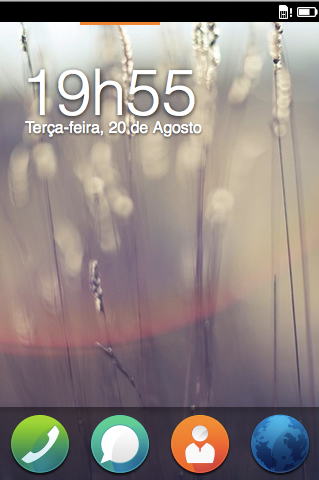

# Einleitung {#introduction}

## Firefox OS

[Firefox OS](http://www.mozilla.org/firefox/os/) ist eine neue Plattform, die von [Mozilla](http://mozilla.org) und seinen Partnern entwickelt wird. Geräte, die mit Firefox OS laufen, sind bereits in vielen Ländern erhältlich und werden zum Jahresende 2013 noch weiter verfügbar sein.

Mit dem Schwerpunkt auf aufstrebenden Märkten hat Firefox OS die Mission, die nächste Milliarde Menschen online zu bringen. Um dieses Ziel zu erreichen, werden Firefox OS-Geräte so konstruiert, dass sie eine *tolle erste Smartphone-Erfahrung* zu einem wettbewerbsfähigen Preis vermitteln. Firefox OS-Geräte sollten nicht mit High-End-Smartphones wie dem Apple iPhone 5S oder Samsung Galaxy S4 verglichen werden; sie wurden gebaut, um eine Alternative zu Feature Phones darzustellen, so dass Leute die genannten Geräten mit einem Firefox OS zu einem erschwinglichen Preis austauschen und eine *volle Smartphone-Erfahrung* machen können.

In aufstrebenden Märkten wie Brasilien und Kolumbien sind Smartphones mit schwacher Performance im Allgemeinen zu teuer für den Durchschnittsnutzer. Die Leute können billige Telefone kaufen, aber die Betriebssysteme auf diesen sind für High-End-Geräte entwickelt worden - von daher neigt die Hardware der Telefone dazu, zu schwächeln, was zu einem schrecklichen Benutzergefühl führt. Firefox OS ist speziell für eingeschränkte Hardware entworfen worden, während es ein angenehmes Benutzergefühl vermittelt.

Ein anderer abweichender Faktor von Firefox OS ist seine Offenheit. Stell dir die aktuellen Mainstream-Betriebssysteme als geschlossene Silos vor, bei der jeder Verkäufer das Privileg hat, den Entwicklern und Nutzern seinen Weg aufzuzwingen, unabhängig von deren Wünschen (erinnerst du dich daran, als Apple versucht hatte, andere Programmiersprachen als Objective-C von seinem iTunes App Store zu verbannen?). In diesen geschlossenen Ökosystemen kannst du deine Apps nur über authorisierte Kanäle vertreiben - für die gewöhnlich von den Verkäufern ein signifikanter Anteil der Einnahmen erhoben wird.

Neben dem Festnageln von Entwicklern auf proprietäre Vertriebskanäle zwingen dich diese Systeme auch zu ihren Software-Entwicklungswerkzeugen (Software Development Kits, kurz SDK). Wenn du eine native App sowohl für iOS als auch für Android mit den offiziellen Entwicklungswerkzeugen entwickeln willst, musst du eine App in Objective-C und die andere in Java schreiben. Das bedeutet, dass ein Entwickler im Hinblick auf den Code nur einen sehr kleinen Teil bei beiden Projekten nutzen kann (und vielleicht noch die Assets wie Bilder wiederverwerten kann). Dieser Art von Aufwand nötigt den Entwickler dazu, zwei Programmiersprachen zu lernen und die selbe Anwendung zwei Mal zu schreiben.

Firefox OS unterscheidet sich darin, dass es "HTML5" als Entwicklungsplattform benutzt. HTML5 ist dabei ein Ausdruck aus dem Marketing, der benutzt wird, um die sich stetig weiterentwickelnde Sammlung von Web-Standards zu beschreiben, die besser bekannt sind als HTML, CSS und JavaScript. Diese lizenzfreien Standards sind von allen großen Browser-Herstellern implementiert worden, was Webanwendungen erst möglich macht. Indem diese HTML5 umfassende Technologien vorangetrieben werden, sind Millionen von Webentwicklern bereits fähig, Code für Firefox OS zu schreiben. Und Apps für Firefox OS sind leicht auf andere Plattformen zu portieren, indem Wrapper wie [PhoneGap](http://phonegap.com) benutzt werden.

## Die Plattform, die HTML5 verdient

Das Internet ist überall. Es befindet sich auf deinem Computer, deinem Handy, Smart-TV und sogar in deiner Videospiel-Konsole. Die Programmiersprache des Webs, JavaScript, ist eine der beliebtesten Sprachen weltweit. Wie bereits erwähnt, meinen die Leute normalerweise die Sammlung von drei Technologien (HTML, CSS und JavaScript), wenn sie von HTML5 sprechen. Jüngste Fortschritte in HTML haben eine Reihe neuer Funktionen nach sich gezogen - erweiterte Formular-Kontrolle, Web Sockets und mehr semantische Auszeichnung - wenn man sie mit XHTML 1.0 oder HTML 4.01 vergleicht. Fortschritte in CSS haben auch eine Menge neuer Funktionen wie Flexbox und CSS Animationen eingeführt, die das Enwickeln wunderschöner responsiver Layouts um einiges erleichtert. Und jüngste Fortschritte in JavaScript führten zu signifikanten Performance-Verbesserungen und neuen Fähigkeiten, während sie dabei immer noch sowohl für Anfänger als auch für bewährte Entwickler leicht zu benutzen bleiben.

Im Wesentlichen ist Firefox OS eine Erweiterung des Mobile Web. Indem HTML5 zu einem First-Class-Objekt wurde, hat Mozilla die Plattform für Millionen von Webentwicklern geöffnet. Selbst wenn einige andere Browserhersteller HTML5 in ihren Handys implementiert haben, geht Firefox OS doch weit darüber hinaus, indem es eine Reihe von APIs anbietet, um die darunterliegende Hardware und das System mit JavaScript anzusprechen. Diese APIs werden gemeinhin WebAPIs genannt.

## Die Hardware mit WebAPIs ansprechen

Einige frühere Betriebssysteme haben bereits versucht, Web-Technologien zum Erstellen von Apps zu benutzen. Beispielsweise war es ausschließlich mit Web-Technologien möglich, Apps für das erste iPhone zu entwickeln. Diese waren allerdings eingeschränkt, da sie keinen Zugriff auf die Hardware oder das Gerät erhielten - was zur Folge hatte, dass nur eine begrenzte Anzahl von Anwendungen geschrieben werden konnte. Sobald Apple den Entwicklern erlaubte, Apps in Objective-C zu schreiben und auch noch Zugriff auf Geräte-Funktionen gewährte, befeuerte das eine riesige Innovation. Leider bekamen Web-Apps keinen Zugriff auf die Geräte-Funktionen, so dass sie nur Second-Class-Objekte darstellen - was sie unattraktiv für Nutzer und Entwickler gleichermaßen machte, da sie nicht mit nativen Apps mithalten konnten.

Wenn wir von Geräte-Funktionen sprechen, meinen wir damit den Zugriff auf Hardware und Betriebssystemfunktionen und -dienste: Wir sprechen von Dingen wie das Aktualisieren des Adressbuches, das Senden von SMS, dem Zugriff auf die Kamera und Galerie. Bei Firefox OS sind [WebAPI](https://wiki.mozilla.org/WebAPI)s genau dafür zuständig.

Eine andere frühere Plattform, WebOS, bot auch Zugriff auf die Hardware mit JavaScript, aber es wurde nie versucht, seine APIs zu standardisieren. Mozilla arbeitet mit dem W3C und anderen Stakeholder zusammen, um sicher zu stellen, dass WebAPIs zu einem offenen Standard werden und andere Browser sie übernehmen. Wenn diese APIs in anderen Browsern implementiert wurden, wirst du immer weniger Änderungen vornehmen müssen, um deine App auf verschiedenen Betriebssystem laufen zu lassen.

Es ist dabei wichtig zu betonen, dass WebAPIs nicht ausschließlich auf Firefox OS-Geräte beschränkt bleiben. Mozilla implementiert es für andere Plattformen, auf denen Firefox läuft, wie beispielsweise dem Desktop und Android. Auf diese Weise kannst du *Offene Web-Anwendungen* in Firefox OS, Firefox auf dem Desktop und Firefox für Android benutzen.

## Die Freiheit, zu entwickeln und zu verteilen

Wie alles, was Mozilla tut, ist Firefox OS offen und frei entwickelt worden. Sämtliche Entwicklung kann im [Mozilla B2G Repository](https://github.com/mozilla-b2g/B2G) auf GitHub verfolgt werden. Mit Firefox OS hast du sowohl die Freiheit, die Entwicklung des Systems zu folgen und zu ihr beizutragen, als auch die Freiheit, die Anwendungen in deinem eigenen Channel oder im [Firefox Marketplace](https://marketplace.firefox.com/) zu vertreiben. Was wirklich beeindruckend ist, dass alle Systemanwendungen in HTML5 geschrieben wurden, so dass du sie einsehen kannst, um zu sehen, wie sie aufgebaut sind.

Der Hauptgedanke liegt darin, dass du nicht für irgendwas auf Mozilla angewiesen bist. Wenn du den Quellcode für das System nehmen möchtest, um es an deine Bedürfnisse anzupassen, dann tu's. Wenn du deine Anwendungen für den internen Gebrauch in deinem Unternehmen entwickelst oder deine Apps nur über deine eigenen Website verteilen willst, dann hast du die Freiheit, es so zu machen. Für gewöhnlich bist du bei anderen Plattformen auf den offiziellen App Store als einzigen Vertriebskanal für deine Anwendungen angewiesen. Firefox OS hat auch einen offiziellen App Store namens Firefox Marketplace, der ein Zulassungsprozess hat, aber du bist frei, deine Apps außerhalb dieses Stores zu verteilen, wenn du es möchtest. Wie du auch im Web deine Homepage hosten kannst, wo immer du willst, kannst du dasselbe mit deinen Anwendungen für Firefox OS machen.

Dies kommt leider mit einer kleinen Einschränkung: einige der WebAPIs sind zu sicherheitsrelevant, als dass man sie für jeden freigeben könnte. Um Apps mit einigen dieser "privilegierten" APIs zu verteilen, musst du sie von Mozilla signieren und reviewen lassen.

## Zusammenfassung

HTML5 ist gekommen, um zu bleiben und kann nur noch besser werden. Firefox OS ist ein neues offenes Betriebssystem von Mozilla, das vollständig auf Web-Technologien setzt. Das System wird offen entwickelt und bietet eine robuste HTML5-Implementation ein, die über das hinaus geht, was andere Plattformen anbieten, indem WebAPIs angeboten werden, die eine Sammlung von APIs zum Zugriff auf *Hardware und Betriebssystem-Dienste via JavaScript* gewähren. Diese neuen APIs werden durch das World Wide Web Consortium (W3C) standardisiert und hoffentlich in der Zukunft von anderen Browsern übernommen.

Im nächsten Kapitel werden wir einen schnell zusammentragen, was du benötigst, um etwas für Firefox OS zu entwickeln.
