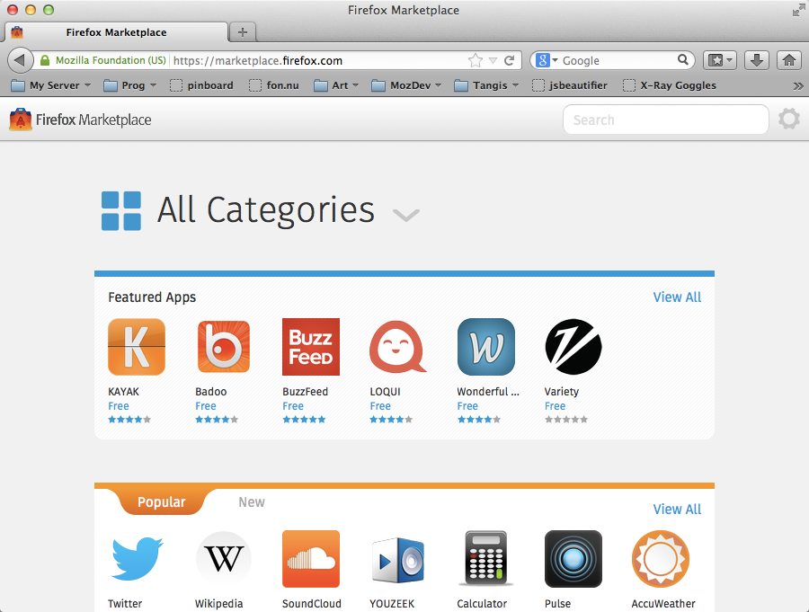
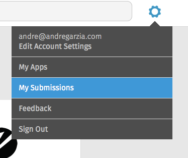
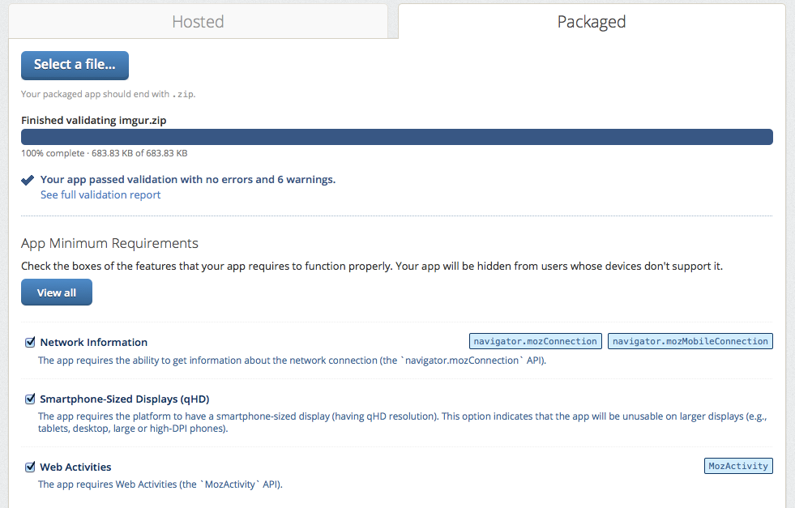

# Der Firefox Marketplace

Der [Firefox Marketplace](http://marketplace.firefox.com) ist ein Online-Shop, bei dem du Anwendungen für Firefox OS, Firefox und Firefox für Android kaufen oder herunterladen kannst. Es ist der Hauptkanal für das Vertreiben von Firefox OS-Anwendungen, auch wenn du nicht auf ihn beschränkt bleiben musst. Wenn du Dinge außerhalb des Marketplace vertreiben willst, lies bitte das [vorige Kapitel](#distribution).

Um deine App auf den Marketplace zu bringen, musst du dich via [Mozilla Persona](https://login.persona.org/about) identifizieren. Klick einfach auf **Anmelden** und folge den Anweisungen. Nachdem du identifiziert worden bist, kannst du Apps zum Firefox Marketplace senden.

## Checkliste im Vorfeld des Einsendens einer App beim Marketplace

Alle Anwendungen, die beim Marketplace eingesendet werden, durchlaufen einen Zulassungprozess (das klingt schlimmer als es ist!). Hosted Apps haben dabei einen abgespeckteren Prozess als privilegierte, denn sie sind benutzen weniger heikle APIs. Bevor du deine Anwendung beim Marketplace einsendest, prüfe [die Marketplace Prüfkriterien](https://developer.mozilla.org/en-US/docs/Web/Apps/Publishing/Marketplace_review_criteria). Die wichtigsten Aspekte sind meiner Meinung nach:

* Firefox OS-Geräte haben keinen **Zurück-Knopf** wie Android oder dein Desktop-Browser. Wenn der Benutzer zu einem Bildschirm innerhalb deiner Anwendung navigiert, von dem es keinen Zurück gibt (bspw. weil er in eine Sackgasse gerät), wird deine App abgelehnt.
* Deine App sollte ein 60x60 Icon und eine klare Beschreibung haben.
* Deine App sollte tun, was in ihrer Beschreibung steht. Das eine sagen und etwas anderes tun, wird zu einer Ablehnung führen.
* Wenn deine App nach einer bestimmten Berechtigung fragt, sollte diese auch irgendwo in deinem Code benutzt werden. Wenn du deine Anwendung als privilegierte App anmeldest und diese APIs nicht benutzt, wird sie zurückgewiesen und du gefragt, sie noch einmal als einfache App einzusenden.
* Deine Anwendung benötigt eine *Datenschutzerklärung*.
* Manifest-Dateien sollten mit dem korrekten MIME-Typ ausgeliefert werden und von derselben Domain stammen, auf der auch die App gehosted wird.

Es gibt noch andere Kriterien, die im obigen Link diskutiert werden - und die Regeln können sich ohne Ankündigung ändern. Es wird die Zeit wert sein, die Seite durchzulesen. Das Abweisen deiner Anwendung nur wegen eines kleinen und leicht zu behebenden Fehlers stellt eine riesige Verschwendung von Zeit dar. Von daher besser von Anfang an die Dinge richtig angehen (die Reviewer lieben es, gute Apps zu bestätigen!).

## Deine App für eine Einsendung vorbereiten

Die benötigten Schritte zum Einsenden einer App beim Marketplace unterscheiden sich je nachdem, ob es eine Hosted oder eine Packaged App ist. Für eine Hosted App genügt es, wenn sie über das Internet mit dem korrekten MIME-Typ erreichbar und das Manifest vorhanden ist. Packaged Apps müssen mit *zip* komprimiert werden und benötigen mehr Aufmerksamkeit.

Viele Entwickler machen den Fehler, den die Anwendungsdateien enthaltenden Ordner auszuwählen und ihn zu zippen. Dies führt dazu, dass das Zip-Archiv einen Ordner enthält, der die App enthält. Das ist aber nicht der richtige Weg, eine Firefox OS-Anwendung zu zippen. Dieser besteht darin, die Dateien und Ordner so zu komprimieren, dass die Manifest-Datei in der *Wurzel-Ebene* des Zip-Archivs landet. Auf Mac OS X und GNU/Linux kannst du das Terminal benutzen und zum Anwnendungsordner navigieren und dort einen Befehl wie `zip -r myapp.zip *` benutzen, um die Dinge korrekt zu komprimieren, wie das Bildschirmfoto unten zeigt.

Dieses Zip-Archiv ist das, was wir beim Marketplace einreichen.

## Eine App beim Marketplace einreichen

Jetzt, nachdem deine Anwendung bereit ist und wir getrost wissen, dass es die Prüfkriterien erfüllt, wird es Zeit, dass wir sie beim Marketplace einreichen. Dazu navigiere zu **Meine Einsendungen**, indem du den Zahnrad-Knopf oben auf der Marketplace-Seite benutzt.

Innerhalb der Anwendungen-Verwaltungsseite musst du **Eine App einreichen** aus dem Menü oben anklicken.

Dieser Link führt dich zu einem Formular zum Einsenden neuer Apps wie unten auf dem Bildschirmfoto dargestellt.

Auf dieser Seite kannst du folgende Optionen auswählen:

* Ist es eine Hosted oder eine Packaged App?
* Ist es kostenlos oder bezahlpflichitg (oder beinhaltet es *In-App-Käufe*)?
* Für welche Art von Geräten (Firefox OS, Firefox Desktop, Firefox für Smartphones, Firefox für Tablets) ist es verfügbar?

Nachdem du diese Entscheidungen getroffen hast, wirst du zu einem zweiten Bildschirm geführt. Für dieses Buch beschränken wir uns auf Packaged Apps, aber der Vorgang für Hosted Apps ist analog.

Im restlichen Teil dieses Kapitels nehmen wir an, dass wir eine kostenlose Firefox OS Packaged App verteilen. In diesem Falle müssen wir das im letzten Abschnitt vorbereitete Zip-Archiv hochladen.

Nachdem die Datei hochgeladen wurde, wird sie einem automatisierten Prozess unterzogen und ein Bericht mit vielen Optionen wird angezeigt.

Auf dem obigen Bild können wir sehen, dass die von mir beim Marketplace eingereichte App keine Fehler, aber sechs Warnungen enthielt. Um dieses Textes willen öffnen wir die Warnung, um die **Minimal-Anforderungen** für diese App zu sehen. In diesem Falle sollte die letzte Option *Smartphone-große Bildschirme (qHD)* abgewählt werden, da unsere Anwendung sich an beliebige Größen anpasst.

Der nächste Schritt wird **Schritt #3: Details** genannt und beinhaltet die Informationen über deine Anwendungen wie Kategorie, Beschreibung, Bildschrimfotos usw.

Nachdem die Details ausgefüllt wurden, ist der Einreichungsprozess abgeschlossen. Jetzt musst du nur noch auf die Zustimmung der Marketplace-Reviewer warten. Glückwunsch, du hast eine Firefox OS-Anwendung verteilt!!!

Auf der [Anwendungs-Verwaltungsseite](https://marketplace.firefox.com/developers/submissions) kannst du den Status der Einreichung einsehen und bei Bedarf Details abändern.

Um mehr über das Einreichen von Anwendungen beim Firefox Marketplace zu erfahren, lies [diesen Artikel im Firefox OS Entwicklerzentrum](https://marketplace.firefox.com/developers/docs/submission).

## Zusammenfassung

Glückwunsch!!! Du hast eine neue Anwendung beim Firefox Marketplace eingereicht, du bist dabei, einen brandneuen Markt zu erschließen!

Ich hoffe, dir hat dieser Schnellkurs gefallen. Ich plane, ihn oft zu aktualisieren und auszuweiten - also halt die Augen offen und registrier dich für Updates. Falls du dieses Buch von Leanpub heruntergeladen hast, ist alles gut, denn du wirst über E-Mail über jegliches Update informiert. Falls du es woanders heruntergeladen hast, überleg dir, ob du es nicht von [der offiziellen Seite auf Leanpub](http://leanpub.com/quickguidefirefoxosdevelopment) herunterladen willst und dich bei der Gelegenheit mit deiner E-Mail registriert. Es ist kostenlos und du erhälst kein Spam. Versprochen.

Bitte gib mir Feedback. Dieses Buch wurde in Nachtschichten vor einer Tech-Konferenz geschrieben und man sieht es, wie sehr ich dieses Projekt liebe und seinen Erfolg sehen möchte. Mich kann man für Feedback über meinen Twitter-Account [@soapdog](http://twitter.com/soapdog) und per E-Mail [fxosquickguide@andregarzia.com](mailto:fxosquickguide@andregarzia.com) erreichen. Meine Homepage ist [http://andregarzia.com](http://andregarzia.com).

Jetzt nachdem du Teil der Firefox OS-Appentwickler geworden bist, werd Teil der eben tolleren Mozilla-Community: Hilf, das Internet offen, frei und von Nutzern für Nutzern zu halten. Tritt uns bei auf [https://www.mozilla.org/contribute/](https://www.mozilla.org/de/contribute/) und hilf Firefox OS wachsen!

