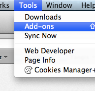

# Setup für Firefox OS App-Entwicklung {#setup}

## Die Gecko-Engine

Browser benutzen verschiedene Engines, um Webseiten zu rendern: Google Chrome und Opera benutzen Blink (ein Fork von WebKit), Internet Explorer benutzt Trident, während Safari WebKit benutzt. Mozilla hat seine eigene Engine, Gecko genannt, welche im Firefox Desktop-, Firefox für Android- und Firefox OS-Browser benutzt wird. Da diese Produkte dieselbe Engine benutzen, ist es möglich, für Firefox OS zu entwickeln und dabei den Firefox Desktop-Browser zu benutzen (wenn auch mit Einschränkungen[^engines]).

[^engines]: Auch wenn dieselbe Engine benutzt in allen Mozilla-Produkten genutzt wird, liegt die Version der Engine im Firefox OS im Allgemeinen hinter der des Desktop-Browsers zurück. Das liegt daran, dass der Veröffentlichungszyklus von Firefox OS derzeit langsamer ist als der des Desktop-Browsers. In der Praxis bedeutet das, dass einige Funktionen nicht verfügbar sein könnten (oder sich so verhalten wie erwartet), sowie du sie auf dem Firefox OS ausprobierst - von daher teste deine Anwendungen immer auf einem Firefox OS-Gerät. Behalte außerdem im Hinterkopf, dass Nutzer verschiedene Versionen von Firefox OS benutzen könnten, so dass sie nicht alle Bleeding Edge-Funktionen haben könnten. Stelle also sicher, immer auch eine Rückfall-Möglichkeit zu haben, falls eine Funktion nicht verfügbar sein sollte.

## Welche Anwendungen benötigst du?

Um Apps für Firefox OS zu entwickeln und zu testen brauchst du:

 * Eine aktuelle Version des [Firefox Browsers](http://getfirefox.com).
 * Den [Firefox OS Simulator](https://addons.mozilla.org/de/firefox/addon/firefox-os-simulator/). 
 * Einen Text-Editor zum Programmieren[^editors].
 
[^editors]: Es gibt viele gute Editoren mit unterschiedlichem Grad an Komplexität und Funktionen. Ein sehr beliebter, den ich für all die empfehlen kann, die keinen Lieblingseditor haben, ist [SublimeText](http://sublimetext.com/). Persönlich benutze ich [WebStorm](http://www.jetbrains.com/webstorm/), welche eine komplette IDE zur Web-App-Entwicklung darstellt.
  
## Den Firefox OS Simulator installieren

Nachdem du Firefox installiert hast, besteht der nächste Schritt darin, den Firefox OS Simulator zu installieren, der zum Testen unserer Anwendungen benutzt wird. Im Firefox wechsle dazu in das **Werkzeuge**-Menü und wähle **Add-ons**.

Über die Suchleiste in der oberen rechten Ecke suche nach **Firefox OS Simulator** und installiere das Add-On durch Klick auf den Installieren-Knopf.

Nach der Installation des Add-Ons kannst du den Simulator über das **Werkzeuge -> Web-Entwickler -> Firefox OS Simulator** erreichen.

Alternativ kannst du auch auf der [Firefox OS Simulator](https://addons.mozilla.org/de/firefox/addon/firefox-os-simulator/)-Add-On-Seite herunterladen und von dort installieren.

## Zusammenfassung

In diesem Kapitel haben wir gelernt, dass alles, was wir zur Entwicklung von Firefox OS Apps benötigen, der Firefox Webbrowser und der Firefox OS Simulator ist (und ein guter Text-Editor).

Nachdem wir jetzt also alle benötigten Werkzeuge aufgesetzt haben, lass uns einige Grundkonzepte lernen, bevor wir unsere erste App entwickeln.
