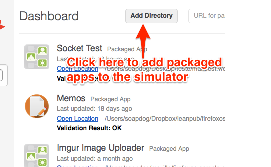

# Der Firefox OS Simulator {#simulator}

Wir haben den Firefox OS Simulator im [Kapitel über das Vorbereitung der Umgebung](#setup) installiert und wir benutzten ihn im [Kapitel über das Entwickeln unserer ersten App](#firstapp). Jetzt werfen wir einen tieferen Blick in die Funktionen des Simulators und lernen, wie übliche Aufgaben erledigt werden.

Um mehr darüber zu lernen, lies [die Firefox OS Simulator Dokumentation](https://developer.mozilla.org/en-US/docs/Tools/Firefox_OS_Simulator) im MDN.

## Apps hinzufügen

Du kannst sowohl Hosted als auch Packaged Apps zum Simulator hinzufügen. Lass uns doch einmal sehen, wie das für jeden Typ aussieht.

### Packaged Apps hinzufügen

Du hast bereits gesehen, wie Packaged Apps zum Simulator hinzugefügt werden, als wir [unsere erste App erstellt haben](#firstapp), aber wir wiederholen es hier noch einmal kurz, damit ich dir zeigen kann, was alles möglich ist.

Um eine neue Packaged App hinzuzufügen, klicke auf den **Add Directory**-Knopf im **Simulator Dashboard** wie auf dem Bildschirmfoto unten abgebildet.

Sowie du auf den im Bild hervorgehobenen Knopf klickst, öffnet Firefox einen Dateiauswahl-Dialog. Du sollst deine Festplatte nach der **App-Manifest-Datei** für die hinzuzufügende Anwendung durchsuchen. Wenn es keine Probleme mit dem Manifest gab und deine Startdatei in Ordnung ist, wird die Anwendung zum Simulator hinzugefügt und gleich gestartet. Falls es irgendein Problem mit dem Manifest oder einer anderen Datei gibt, wird eine Fehlermeldung auf dem Dashboard angezeigt.

Sowie du deine Anwendung aktualisierst, solltest du auf **Refresh** klicken, um die Version im Simulator zu aktualisieren (alternativ kannst du auch CMD/STRG+R im Simulatorfenster drücken, um zu aktualisieren).

### Hosted Apps hinzufügen

Falls du an einer Hosted App arbeitest, solltest du sie mit einem Webserver testen. Versuche nicht, die oben beschriebene Methode für Hosted Apps zu benutzen, denn dann könntest du einige Fehler übersehen, die nur in einer gehosteten Umgebung auftreten - beispielsweise das Ausliefern der Manifest-Datei mit dem falschen *MIME-Typ*. Behalte im Hinterkopf, dass dich der Simulator nicht über einen falschen MIME-Typ benachrichtigen wird, aber es ist wichtig, diese Dinge gleich anzugehen, bevor du eine App im Mozilla Marketplace einreichst.

Die meisten Hosted Apps sind keine Anwendungen, die ausschließlich für Firefox OS entwickelt wurden, sondern responsive Websites, die in der Lage sind, sich an verschiedene Geräte und Auflösungen anzupassen. Diese Web-Apps haben gewöhnlich ein komplexes Backend, dass funktionieren muss, damit die App arbeiten kann und deswegen musst du die App mit einem tatsächlich laufenden Web-Server testen, der sich um das Backend-Zeug kümmert.

Um die App im Simulator zu starten, gib die URL deiner Anwendung in das Textfeld oben ein und klicke auf den **Add URL**-Knopf.

Nachdem du den Knopf geklickt hast, wird das Manifest überprüft und falls es in Ordnung ist, wird die Anwendung zum Simulator hinzugefügt und gestartet. Genauso erhalten wir auch hier wie bei Packaged Apps eine Fehlermeldung, wenn etwas nicht mit der Manifest-Datei stimmt (z.B. "App-Einreichung im Marketplace benötigt mindestens ein 128 Icon").

Genauso wie bei Packaged Apps musst du auf **Refesh** klicken, wenn du an deiner Anwendung etwas änderst, um die Version im Simulator zu aktualisieren (oder eben CMD/STRG+R im Simulator-Fenster drücken).

## Debuggen

Nachdem die Anwendung zum Simulator hinzugefügt wurde, sind wir in der Lage, sie mit einem Klick auf den rechts neben der Anwendung platzierten **Connect**-Knopf zu debuggen. Dies wird die Anwendung im Simulator starten und die **JavaScript-Konsole** öffnen und mit deiner App verbinden.

Nachdem du den Knopf gedrückt hast, sieht dein Bildschirm in etwa so aus:

Nachdem die Werkzeuge mit deiner App verbunden wurden, kannst du dein JavaScript testen, deinen DOM debuggen, Stylesheets bearbeiten usw. Wie diese Startup-Typen so schön zu sagen pflegen: *Variiere, bis deine App gut ist*.

Nachdem deine App also im Simulator gut läuft, wird es Zeit, sie auf einem realen Gerät zu testen.

## Apps auf realen Geräten testen

Nichts ersetzt einen Test auf einem realen Gerät. Im Simulator testest du mit der Maus und Klicken auf einem Computer-Bildschirm; auf einem realen Gerät hingegen benutzt du deine Finger auf dem Touchscreen und bedienst physische Knöpfe. Es ist eine ganz andere Benutzer- und Entwicklungs-Erfahrung.

Als ein Beispiel, warum diese Art des Testens von Bedeutung ist, lass mich dir eine kurze Geschichte erzählen: Vor einigen Jahren haben Raphael Eckhardt (der das Buchcover erstellt hat) und ich an einem Puzzle-Spiel ähnlich wie Bejeweled gearbeitet. Unser Spiel benutzte dabei Drag & Drop von einigen Puzzleteilen auf einem Brett und funktionierte tadellos im Simulator.

Als wir das Spiel auf einem tatsächlichen Smartphone getestet haben, mussten wir einsehen, dass die Spielelemente nicht im geringsten berührungsfreundlich waren: wenn eine Hand über den Bildschirm gehalten wurde, verschwand das Brett dahinter. Schlimmer noch, die Teile, die der Benutzer bewegen sollte, waren kleiner als der Finger, so dass der Spieler nicht sehen konnte, was er tat! Zusammengefasst hat unsere UX also ziemlich versagt. Das konnte nur geschehen, weil wir die Dinge nur im Simulator mit einer Maus und einem winzigen Cursor getestet hatten. Nachdem wir entschieden, es mit den viel größeren Finger zu probieren, mussten wir unsere UI überarbeiten.

Um dir eine ähnlich deprimierende Erfahrung zu ersparen, teste immer auf einem realen Gerät … oder zweien oder mehr, wenn du welche zu fassen bekommst. Und teste oft mit nur einfachen Prototypen: ansonsten kannst du mitunter wertvolle Zeit und Geld verschwenden, die du in die Neuerstellung der Assets investieren musst.

Du kannst Developer Preview-Geräte mit Firefox OS im [Geeksphone Shop](http://shop.geeksphone.com/en/) kaufen. Ich empfehle das [Geeksphone Keon](http://www.geeksphone.com/), weil dieses Gerät ähnliche Specs besitzt, wie es die meisten anderen Geräte haben werden, die Mozillas Partner entwickeln.

Du kannst auch ein Gerät kaufen, dass sich an Endkunden wendet, sowie du in einem der Länder lebst, wo es sie bereits gibt. Eine dritte Möglichkeit besteht darin, Android durch Firefox OS auf einigen Geräten zu ersetzen (wobei es nur bestimmte Geräte sind, die dadurch bricken können - beschwer dich dann nicht bei mir!) - aber das kann ich nicht empfehlen, es sei denn, du bist ein Power User, der seine Zeit gerne mit Hacken verbringt.

## Sich mit einem Firefox OS-Gerät verbinden

Falls du ein Firefox OS-Gerät besitzt (und du ggf. die nötigen Treiber nachinstalliert hast), kannst du deine Apps direkt vom Simulator auf das Gerät pushen, wenn es mit deinem Computer verbunden ist. Sowie der Simulator ein verbundenes Firefox OS-Smartphone entdeckt, erscheint eine Meldung **Device Connected** auf dem Bildschirm.

Falls dein Gerät verbunden (und erkannt) wurde, fügt der Simulator einen weiteren Knopf neben **Refresh** und **Connect** hinzu, der mit **Push** beschriftet ist. Wenn du diesen betätigst, erscheint ein **Berechtigungsfenster** auf dem Bildschirm des Geräts, der nach einer Bestätigung zur Installation der gepushten App fragt.

Und unten können wir die Berechtigungsanfrage sehen.

Nachdem die Anwendung auf dem Gerät läuft, kannst du *Remote Debugging* benutzen, um eine JavaScript-Konsole zum Debuggen der App zu verbinden.

## Zusammenfassung 

Zusammengefasst ist der Firefox OS Simulator ein beeindruckendes Werkzeug, um Firefox OS-spezifische Apps zu entwickeln - aber es hat einige Einschränkungen, wenn du für eine Reihe von Geräten entwickeln willst (beispielsweise kann er nicht emulieren, wie sich Firefox OS auf einem Tablet anfühlen würde).

Abgesehen davon, dass du dich beeindruckend und mächtig anfühlst, sollte dir das Buch an diesem Punkt hoffentlich einen guten Eindruck vom Workflow zum Erstellen von Apps für Firefox OS-Apps gegeben haben. Im nächsten Kapitel sehen wir uns an, wie wir unsere Apps an Nutzer verteilen können.
